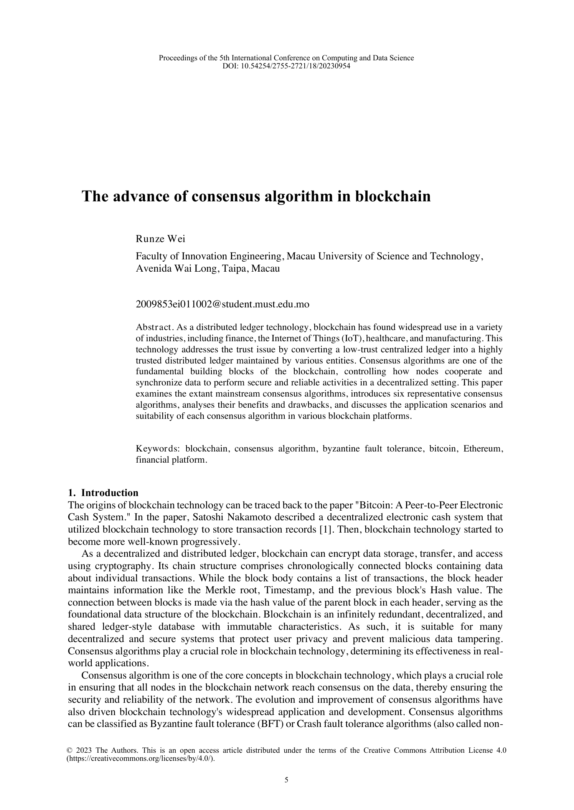

  <strong>Language:</strong>
  
  

# Blockchain Consensus Algorithms Survey

[Paper PDF](paper/the-advance-of-consensus-algorithm-in-blockchain.pdf) · [Expert analysis (中文)](docs/expert-analysis.zh-CN.md) · [Sharing kit (中文)](docs/share-kit.zh-CN.md)

  

  <em>Click the high-resolution preview to open the complete paper PDF.</em>

## Why I wrote this paper

I wrote this paper in 2023 out of a personal interest in blockchain and a simple question: **how do distributed participants agree on one ledger without a central coordinator?**

That curiosity became a concise survey of six representative approaches often discussed in blockchain literature: Proof of Work, Proof of Stake, Delegated Proof of Stake, PBFT, Paxos, and Raft.

My goal was not to propose a new protocol called “Advance Consensus.” The paper is an introductory study that organizes each approach's basic idea, strengths, limitations, and suitable use cases.

## Paper

> Runze Wei. “The advance of consensus algorithm in blockchain.” *Applied and Computational Engineering*, vol. 18, pp. 5–15, 2023. [doi:10.54254/2755-2721/18/20230954](https://doi.org/10.54254/2755-2721/18/20230954)

This is a review and comparison paper. It does not introduce a new consensus algorithm or provide a protocol implementation.

## What the survey covers

| Mechanism | Simple intuition |
|---|---|
| **Proof of Work (PoW)** | Uses verifiable computation to weight block production and make history expensive to rewrite |
| **Proof of Stake (PoS)** | Uses staked value to select validators and hold them economically accountable |
| **Delegated Proof of Stake (DPoS)** | Lets stakeholders elect a smaller group of delegates to produce and validate blocks |
| **PBFT** | Lets known replicas agree despite a bounded number of Byzantine faults |
| **Paxos** | Uses intersecting majority quorums to reach agreement under crash faults |
| **Raft** | Provides an understandable, leader-based replicated log under crash faults |

The paper introduces the basic workflow of each mechanism, then compares their efficiency, energy use, fault assumptions, decentralization, and typical application settings.

## The main takeaway

There is no universally “best” consensus mechanism. Each design makes a different trade-off:

- open participation usually needs a Sybil-resistance mechanism such as work or stake;
- a smaller, known validator set can reach agreement faster, but depends more heavily on membership and governance;
- stronger Byzantine-fault tolerance generally costs more communication than crash-fault-only replication;
- performance numbers are meaningful only when the network, adversary, membership, and finality assumptions are stated.

The value of the survey is not a single ranking. It is the comparison framework: **understand the assumptions first, then compare the trade-offs.**

## Reading it today

Consensus technology has continued to evolve since the paper was published. The six items are also not all at the same abstraction layer: PoW, PoS, and DPoS are commonly discussed as blockchain membership and validator-selection families, PBFT is Byzantine-fault-tolerant state-machine replication, while Paxos and Raft are crash-fault-tolerant replication protocols.

To keep this page faithful to the original, stricter protocol corrections and the 2026 technical context are collected separately in the [expert analysis](docs/expert-analysis.zh-CN.md). A structured comparison is available in the [consensus matrix](comparison/consensus-matrix.csv).

## Repository contents

- [`paper/`](paper/): publisher PDF, provenance, checksum, and BibTeX.
- [`comparison/consensus-matrix.csv`](comparison/consensus-matrix.csv): structured protocol comparison.
- [`docs/expert-analysis.zh-CN.md`](docs/expert-analysis.zh-CN.md): deep technical review, corrections, and decision framework.
- [`docs/share-kit.zh-CN.md`](docs/share-kit.zh-CN.md): ready-to-use short post, talk outline, and Q&A.
- [`docs/sources.md`](docs/sources.md): original papers and official documentation.
- [`CITATION.cff`](CITATION.cff): machine-readable citation metadata.

## Scope and license

This repository is educational research material, not financial advice and not a production-protocol security assessment. The paper and derived first-page image are © Runze Wei (2023), distributed by the publisher under CC BY 4.0. Independent commentary is also available under CC BY 4.0. Linked external material retains its own terms.
