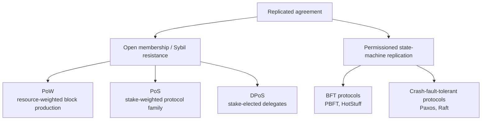

# Blockchain Consensus Algorithms Survey

[中文](README.zh-CN.md) · [Paper PDF](paper/the-advance-of-consensus-algorithm-in-blockchain.pdf) · [Expert analysis (中文)](docs/expert-analysis.zh-CN.md) · [Sharing kit (中文)](docs/share-kit.zh-CN.md)

  

This repository is a bilingual companion to:

> Runze Wei. “The advance of consensus algorithm in blockchain.” *Applied and Computational Engineering* 18.1 (2023): 5–15. [doi:10.54254/2755-2721/18/20230954](https://doi.org/10.54254/2755-2721/18/20230954)

The article reviews Proof of Work, Proof of Stake, Delegated Proof of Stake, PBFT, Paxos, and Raft. This repository preserves that 2023 survey while adding a technically stricter taxonomy, corrections, primary sources, and a 2026 research update.

It is a survey companion, not an implementation of a new protocol called “Advance Consensus.”

## The key distinction

The six mechanisms should not be ranked on one flat axis:

- **PoW, PoS, and DPoS** primarily address open membership, Sybil resistance, validator selection, and chain formation.
- **PBFT** is Byzantine-fault-tolerant state-machine replication for a known validator set.
- **Paxos and Raft** tolerate crash faults, not arbitrary Byzantine behavior.
- Real blockchains often compose layers. Ethereum, for example, uses stake-based validator selection together with the Gasper consensus design.

## Six mechanisms in the paper

| Family | Typical membership | Fault model | Finality style | Most important caveat |
|---|---|---|---|---|
| PoW | Open | Adversarial resource share | Probabilistic | Security depends on hash power, not node count |
| PoS | Open or governed validator set | Protocol-specific Byzantine/economic faults | Protocol-specific | PoS is a family, not one algorithm |
| DPoS | Stake-elected delegates | Protocol-specific | Often fast/deterministic | Delegate concentration creates governance risk |
| PBFT | Permissioned | Byzantine | Deterministic after commit | `3f+1` replicas tolerate `f` Byzantine faults; all-to-all communication limits scale |
| Paxos | Permissioned | Crash fault | Deterministic | Does not tolerate Byzantine replicas |
| Raft | Permissioned | Crash fault | Deterministic | Understandability improves engineering, not the fault model |

The detailed [consensus matrix](comparison/consensus-matrix.csv) is machine-readable.

## Corrections and 2026 update

The original paper is useful as an accessible six-protocol overview, but several statements need tighter framing:

- A PoW “51% attack” refers to control of relevant mining power, not 51% of network nodes.
- Coin-age reset is not a universal description of modern PoS. Ethereum’s current PoS consensus is [Gasper](https://ethereum.org/developers/docs/consensus-mechanisms/pos/gasper/), combining Casper FFG and LMD-GHOST.
- DPoS does not automatically increase decentralization; delegate elections can concentrate operational and governance power.
- PBFT has quadratic normal-case message exchange in the classic design and is not merely “one consensus calculation.”
- Paxos and Raft are CFT protocols; maliciously inconsistent replicas are outside their base model.
- ZooKeeper uses Zab rather than simply being an open-source implementation of Chubby/Paxos.
- Current Hyperledger Fabric documentation distinguishes [Raft ordering](https://hyperledger-fabric.readthedocs.io/en/latest/orderer/ordering_service.html) from a [SmartBFT-based BFT orderer](https://hyperledger-fabric.readthedocs.io/en/latest/raft_bft_migration.html).
- Solana’s Proof of History is a cryptographic clock/order mechanism; consensus is built with stake and Tower BFT around it.
- Ethereum reports that the Merge reduced energy use by approximately [99.95%](https://ethereum.org/roadmap/merge/), rather than 99.5%.

These are repository annotations made in 2026; they do not silently rewrite the 2023 paper.

## How to compare a consensus design

A defensible comparison starts with the deployment assumptions:

1. Is membership open, permissioned, or governed?
2. Is the adversary crash-only or Byzantine?
3. What network timing assumption is required for liveness?
4. Is finality probabilistic or deterministic, and under what conditions can it revert?
5. How is Sybil resistance supplied: computation, stake, identity, or an external admission policy?
6. What are the message, bandwidth, storage, and verification costs?
7. How are leaders/committees selected and rotated?
8. What economic penalties, governance mechanisms, and recovery paths exist?

Only after those questions should latency, throughput, energy, and decentralization be compared.

## Beyond the original six

The post-PBFT landscape includes:

- [HotStuff](https://arxiv.org/abs/1803.05069): leader-based BFT with responsive operation and linear communication under its aggregation assumptions.
- [Narwhal and Tusk](https://arxiv.org/abs/2105.11827) and [Bullshark](https://arxiv.org/abs/2201.05677): DAG-based data dissemination and ordering.
- [Avalanche consensus](https://www.avalabs.org/whitepapers): repeated subsampled voting and metastable convergence.
- Ethereum’s [single-slot finality research](https://ethereum.org/roadmap/single-slot-finality/): an active roadmap topic, not a deployed property to assume today.

## Repository contents

- [`paper/`](paper/): publisher PDF, provenance, checksum, and BibTeX.
- [`comparison/consensus-matrix.csv`](comparison/consensus-matrix.csv): structured protocol comparison.
- [`docs/expert-analysis.zh-CN.md`](docs/expert-analysis.zh-CN.md): deep technical review, corrections, and decision framework.
- [`docs/share-kit.zh-CN.md`](docs/share-kit.zh-CN.md): ready-to-use short post, talk outline, and Q&A.
- [`docs/sources.md`](docs/sources.md): original papers and official documentation.
- [`CITATION.cff`](CITATION.cff): machine-readable citation metadata.

## Scope and license

This repository is educational research material, not financial advice and not a production-protocol security assessment. The paper and derived first-page image are © Runze Wei (2023), distributed by the publisher under CC BY 4.0. Independent commentary is also available under CC BY 4.0. Linked external material retains its own terms.
