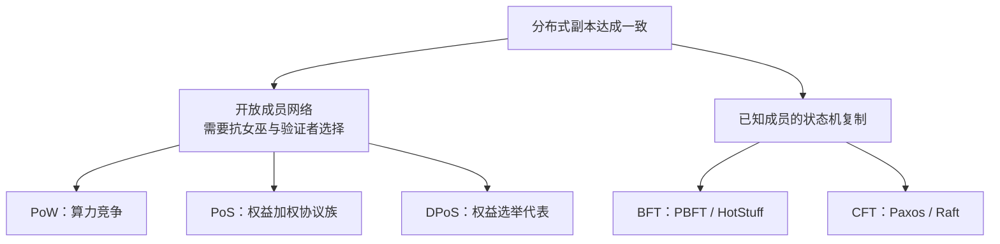

<p align="right">
  <strong>语言：</strong>
  <a href="./README.md"></a>
  <a href="./README.zh-CN.md"></a>
</p>

# 区块链共识算法综述：六类经典机制与 2026 技术校准

[论文 PDF](paper/the-advance-of-consensus-algorithm-in-blockchain.pdf) · [专家深读](docs/expert-analysis.zh-CN.md) · [分享素材](docs/share-kit.zh-CN.md)

[](https://doi.org/10.54254/2755-2721/18/20230954)
[](https://ace.ewapub.com/article/view/4657)
[](https://creativecommons.org/licenses/by/4.0/)

<p align="center">
  
</p>

> 这是一份面向区块链与分布式系统读者的论文伴读：保留 2023 年原文对 PoW、PoS、DPoS、PBFT、Paxos、Raft 的比较，同时用故障模型、成员关系、最终性与抗女巫机制重新整理其技术边界。

## 论文信息

| 项目 | 内容 |
|---|---|
| 正式题名 | *The advance of consensus algorithm in blockchain* |
| 作者 | Runze Wei |
| 出版载体 | *Applied and Computational Engineering*, 18(1), 5–15 |
| 出版类型 | ACE 会议论文集系列中的研究文章；PDF 页眉标注 Proceedings of the 5th International Conference on Computing and Data Science |
| 日期 | 2023-10-23 |
| DOI | [10.54254/2755-2721/18/20230954](https://doi.org/10.54254/2755-2721/18/20230954) |
| 出版方 | [EWA Publishing 文章页](https://ace.ewapub.com/article/view/4657) |
| 许可 | CC BY 4.0 |

论文是一篇综述/比较文章，没有提出名为 “Advance Consensus” 的新共识算法，也没有协议实现或实验代码。本仓库因此定位为论文伴读与专家更新，而不是“官方算法实现”。

## 这个仓库做了什么

- 保存出版方开放获取 PDF、来源说明和 SHA-256 校验值；
- 给出中英双语导读与六类算法比较；
- 把论文原始论述、2026 年技术纠错和后续进展明确分开；
- 用一手论文与官方文档补充 Ethereum、Hyperledger Fabric、Solana 等实际系统；
- 提供可直接用于 GitHub、知乎、微信、LinkedIn 或技术分享会的材料。

## 最关键的概念：六类机制不在同一层



- PoW、PoS、DPoS 主要处理开放网络中的身份权重、验证者/出块者选择与链构建。
- PBFT 面向已知验证者集合中的 Byzantine fault。
- Paxos 与 Raft 面向 crash fault，不防恶意节点发送相互矛盾的消息。
- 实际区块链往往是组合系统，例如权益选择 + 委员会 BFT + fork choice，而不是只运行一个标签化算法。

## 六类算法速览

| 机制 | 典型成员关系 | 故障模型 | 最终性 | 专家校准 |
|---|---|---|---|---|
| PoW | 开放 | 对抗性资源份额 | 概率最终性 | 51% 指相关算力，不是节点数量 |
| PoS | 开放或治理式验证者集 | 取决于具体协议 | 取决于具体协议 | 是协议族，不能用单一“币龄规则”概括 |
| DPoS | 权益持有人选举代表 | 取决于具体实现 | 常为快速/确定性 | 代表集中会带来治理与审查风险 |
| PBFT | 许可制 | Byzantine | commit 后确定 | `3f+1` 容忍 `f` 个 Byzantine；经典通信量为 \(O(n^2)\) |
| Paxos | 许可制 | Crash fault | 确定 | 基础模型不容忍 Byzantine |
| Raft | 许可制 | Crash fault | 确定 | 易理解不等于故障模型更强 |

完整字段见 [`comparison/consensus-matrix.csv`](comparison/consensus-matrix.csv)。

## 对论文内容的 2026 技术校准

### PoW

安全性取决于攻击者所控制的有效工作量比例。节点可以运行完整验证而不参与挖矿，因此“51% 节点攻击”不是准确说法。PoW 的开放参与和客观可验证工作量很有价值，但其概率最终性、能耗和矿池集中需要单独评价。

### PoS

PoS 不是一个固定算法。验证者选择、fork choice、finality gadget、slashing、退出队列和弱主观性都由具体协议定义。Ethereum 当前采用 [Gasper](https://ethereum.org/developers/docs/consensus-mechanisms/pos/gasper/)，由 Casper FFG 与 LMD-GHOST 组合；不能用早期 coin-age reset 代表所有现代 PoS。

### DPoS

DPoS 以投票缩小活跃出块/共识成员集合，从而换取低延迟和高吞吐。代价是投票冷漠、代理固化、串谋和治理权集中。它不天然比 PoW/PoS “更去中心化”。

### PBFT

经典 PBFT 在 `3f+1` 副本中容忍 `f` 个 Byzantine fault，并通过预准备、准备、提交阶段形成确定性决定。其传统全连接消息交换限制大规模验证者集，因此现代协议会使用聚合签名、委员会、流水线或 DAG 数据层。

### Paxos 与 Raft

两者以多数派 quorum 容忍 crash failure。Paxos 是协议族，Multi-Paxos 常在稳定 leader 下复制日志；Raft把 leader election、log replication 和 membership change 明确拆分以改善可理解性。两者都不是基础 BFT 协议。

## 从 2023 到 2026

- Ethereum 官方资料把当前 PoS 共识描述为 Gasper；[The Merge](https://ethereum.org/roadmap/merge/) 报告能耗下降约 99.95%。
- Hyperledger Fabric 当前文档区分 [Raft CFT orderer](https://hyperledger-fabric.readthedocs.io/en/latest/orderer/ordering_service.html) 与 [SmartBFT BFT orderer](https://hyperledger-fabric.readthedocs.io/en/latest/raft_bft_migration.html)。
- Solana 的 PoH 是可验证时钟/排序结构，需与权益和 Tower BFT 一起理解，不能把 PoH 单独当作完整共识。
- [HotStuff](https://arxiv.org/abs/1803.05069) 推进 leader-based BFT 的流水线与通信优化。
- [Narwhal/Tusk](https://arxiv.org/abs/2105.11827) 和 [Bullshark](https://arxiv.org/abs/2201.05677) 将可靠数据传播与共识排序解耦。
- [Avalanche](https://www.avalabs.org/whitepapers) 探索反复随机抽样投票和亚稳态收敛。
- Ethereum 的 [single-slot finality](https://ethereum.org/roadmap/single-slot-finality/) 仍属于路线图研究，不能按已部署能力宣传。

## 专家评价

论文的优点是用较低门槛把公链与传统分布式系统中的经典机制放在一起，让读者看到能耗、效率、去中心化和安全之间存在取舍。

它最需要补强的是分类轴。若不先区分开放/许可成员关系、Crash/Byzantine 故障、概率/确定最终性，读者很容易把“PoW 对比 Raft”误解为可以直接替换的同层协议。论文中部分案例与实现描述也过于概括，适合通过一手协议论文与当前官方文档校正。

更详细的逐项审计、决策框架和后续研究见 [专家视角技术深读](docs/expert-analysis.zh-CN.md)。

## 仓库结构

```text
.
├── README.md
├── README.zh-CN.md
├── CITATION.cff
├── LICENSE
├── assets/
│   └── paper-first-page.png
├── comparison/
│   └── consensus-matrix.csv
├── docs/
│   ├── expert-analysis.zh-CN.md
│   ├── share-kit.zh-CN.md
│   └── sources.md
└── paper/
    ├── README.md
    ├── references.bib
    ├── SHA256SUMS
    └── the-advance-of-consensus-algorithm-in-blockchain.pdf
```

## 引用

```bibtex
@article{Wei2023Consensus,
  author  = {Wei, Runze},
  title   = {The advance of consensus algorithm in blockchain},
  journal = {Applied and Computational Engineering},
  volume  = {18},
  number  = {1},
  pages   = {5--15},
  year    = {2023},
  doi     = {10.54254/2755-2721/18/20230954}
}
```

## 许可与范围

论文和论文首页衍生图由 Runze Wei (2023) 按出版方的 CC BY 4.0 条款发布。仓库独立解读与分享材料同样按 CC BY 4.0 提供。外部链接材料遵循各自许可。本项目用于技术教育，不构成投资建议，也不替代具体协议的安全审计。
