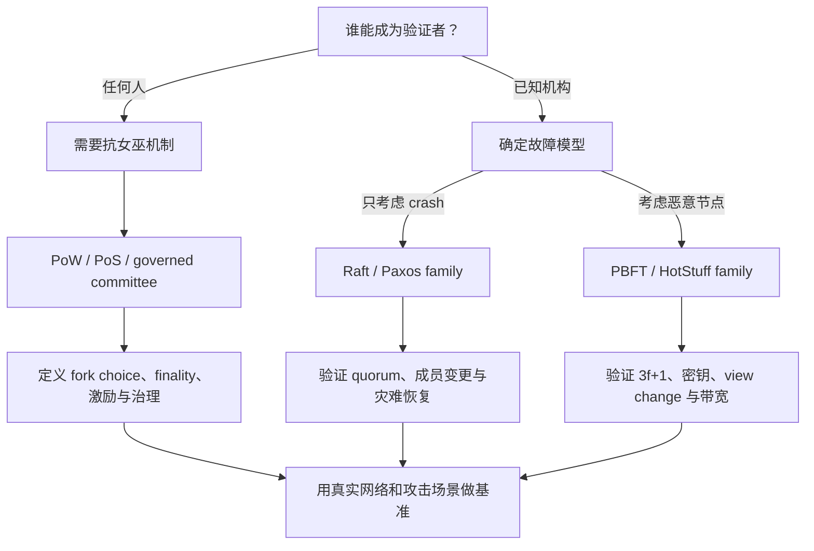

# 专家视角技术深读

> 本文把 2023 年论文的原始综述与 2026 年独立技术评述分开。协议能力以具体版本、故障模型和部署参数为准；下文不是生产系统安全审计或投资建议。

## 1. 先给结论

论文选择 PoW、PoS、DPoS、PBFT、Paxos、Raft 六类机制，覆盖了区块链和传统分布式系统的常见入门主题。真正理解它们的关键不是找一个“综合排名”，而是先识别它们解决的是哪一层问题。

```text
开放网络的成员与权重
  → PoW / PoS / DPoS

已知副本集合如何复制状态
  → Byzantine fault: PBFT 等 BFT 协议
  → Crash fault: Paxos / Raft

实际区块链
  → 抗女巫 + 提议者选择 + 数据传播 + fork choice
    + finality + 执行 + 激励/惩罚 + 治理
```

因此，“Raft 比 PoW 快”可以是一个性能观察，却不是完整设计结论：Raft依赖已知成员和 crash-only 假设，PoW则面向开放网络中的匿名资源竞争。改变算法也同时改变信任边界。

## 2. 共识比较前必须固定的八个问题

### 2.1 成员关系

- **Permissionless**：任何人原则上可以参与，需要抗女巫机制决定权重。
- **Permissioned**：成员由证书、组织或治理流程准入。
- **Hybrid / governed**：开放持币，但活跃验证者由质押门槛、委员会或投票形成。

若不固定成员关系，吞吐和去中心化比较没有共同基线。

### 2.2 故障模型

- **Crash fault**：节点停止、重启、丢消息，但不会故意对不同对象撒谎。
- **Byzantine fault**：节点可以任意偏离协议、签署冲突消息或协同攻击。
- **Economic adversary**：除协议行为外，还需建模资本、借贷、贿赂、MEV 和惩罚。

Paxos/Raft 与 PBFT 的根本差异首先在这里，而不只是消息轮数。

### 2.3 网络假设

安全性和活性必须分开看。许多协议可以在异步期间维持安全，但需要网络最终恢复到一定延迟范围才继续出块/提交。仅写“异步”或“同步”通常不够，应说明是哪些性质依赖该假设。

### 2.4 最终性

- **概率最终性**：确认越深，回滚概率通常越低，但没有单一绝对提交瞬间。
- **确定性/经济最终性**：形成有效 commit/finalization certificate 后，在故障和经济假设内不可逆。

最终性时间必须和安全阈值、网络状态、验证者退出/惩罚一起解释。

### 2.5 抗女巫与领导者选择

PoW 以计算工作量赋权，PoS 以锁定权益与协议规则赋权，许可链依赖外部身份。领导者/委员会选择还需要随机性、可预测性、抗操纵和轮换机制。

### 2.6 复杂度

至少区分：

- 每轮消息数与字节数；
- 签名/聚合签名验证成本；
- 数据可用性与区块传播；
- 稳态和视图切换成本；
- 验证者数量与地理网络延迟；
- 状态存储和执行成本。

TPS 不是协议常数，硬件、交易大小、批量、执行逻辑和 benchmark 方法都会改变结果。

### 2.7 经济与治理

协议安全不只是一条 \(f<n/3\) 或 51% 阈值。还要问：

- 权益或算力是否集中；
- 委托是否导致少数运营者控制；
- 惩罚能否执行，误罚风险如何；
- 软件升级和紧急恢复由谁决定；
- 审查、MEV 和跨协议资本如何影响激励。

### 2.8 运维与恢复

成员变更、密钥泄露、备份恢复、长距离攻击、网络分区、软件 bug 和客户端多样性，往往比理想协议图更决定实际可靠性。

## 3. 六类机制逐项审计

### 3.1 Proof of Work

PoW 让参与者寻找满足难度条件的哈希结果，并用累计工作量为链选择提供客观权重。它把开放网络中的身份问题转化为可验证、昂贵的外部资源。

正确理解：

- 攻击阈值与有效哈希算力有关，不是节点数量；
- 普通全节点验证规则，但不一定贡献链选择所需的工作量；
- 最终性通常是概率性的，确认数是风险管理参数；
- 安全预算来自区块奖励、手续费和矿工机会成本；
- 能源消耗与安全支出、硬件效率和能源结构相关。

不能从“低 TPS”直接得出共识层本身是唯一瓶颈，也不能把矿池份额简单等同于长期完全控制，但集中度确实是重要风险信号。

### 3.2 Proof of Stake

PoS 是一个协议族。共同点是以可惩罚权益代替持续算力消耗，但不同系统在以下方面差异巨大：

- proposer/committee selection；
- fork choice；
- finality gadget；
- slashing 条件；
- inactivity leak；
- weak subjectivity checkpoint；
- validator activation/exit；
- stake delegation 与 liquid staking。

Ethereum 的 Gasper 将 LMD-GHOST fork choice 与 Casper FFG finality 组合。用“持币时间越久概率越高，出块后币龄归零”描述所有现代 PoS 会造成错误泛化。

PoS 降低持续能耗，并可通过惩罚产生经济最终性，但带来新的系统问题：大额权益集中、委托服务商集中、长期密钥攻击、社会层 checkpoint 和治理依赖。

### 3.3 Delegated Proof of Stake

DPoS 通过代币持有人投票选出少量代表，以更小委员会换取更低通信成本与更快确认。它更接近一组治理与验证者选择机制，底层代表之间仍需具体的排序/提交协议。

优势：

- 活跃成员数小，延迟和吞吐更易优化；
- 代表有明确责任和替换路径；
- 协议运维与升级决策速度快。

风险：

- 投票参与率低与代理权固化；
- 交易所/托管商集中投票权；
- 代表互投、利益联盟与审查；
- 治理捕获与协议安全相互耦合。

因此 DPoS 是“效率换取治理集中”的明确设计点，不应自动等同于更高去中心化。

### 3.4 PBFT

经典 PBFT 在 \(n\ge 3f+1\) 的副本集合中容忍至多 \(f\) 个 Byzantine fault。主节点提出请求，副本通过 prepare/commit quorum 锁定一致决定。

核心优点：

- 在模型内提供确定性提交；
- 不依赖高能耗资源竞争；
- 适合组织身份明确的许可网络。

核心限制：

- 经典正常路径需要副本间大量消息，常概括为 \(O(n^2)\)；
- leader 故障会触发 view change；
- 成员管理、PKI 与密钥安全是协议外但不可忽略的信任根；
- validator set 很大时，带宽和签名验证成为瓶颈。

现代 BFT 通过门限/聚合签名、线性通信、流水线、委员会与 DAG 数据层扩展，但这些优化对应新的密码学和网络假设。

### 3.5 Paxos

Paxos 用相交多数派 quorum 保证不会选择两个冲突值。Basic Paxos 解决单值一致性；实际复制日志常使用 Multi-Paxos，在稳定 leader 下重复实例。

需要澄清：

- Paxos 的 safety 不等于 Byzantine safety；
- 接受者按协议行动，只允许 crash、恢复和消息延迟/重排等故障；
- “Paxos 没有 leader”只适合对基础抽象的粗略表述，工程 Multi-Paxos 通常依赖稳定 leader 提高效率；
- 数字签名可以认证消息来源，但不会自动把 Paxos 升级成 BFT。

论文对 Paxos 身份认证的部分说法相互矛盾；分享时应回到 Lamport 原文的 fault model。

### 3.6 Raft

Raft 同样使用多数派日志复制，但有意识地把问题拆成 leader election、log replication 和 safety，并通过任期、日志匹配与投票限制形成清晰状态机。

Raft 的主要价值是可理解性与工程实现路径：

- 稳态由 leader 串行化日志；
- `2f+1` 副本可在最多 `f` 个 crash fault 下保持多数派；
- membership change 需要专门协议，不能直接替换配置；
- 网络分区时少数派不应继续提交。

Raft 不防恶意 leader 编造不同日志、伪造消息或违反状态机规则。要容忍 Byzantine fault，必须采用 BFT 设计而不是只加 TLS。

## 4. 案例纠错

### ZooKeeper

ZooKeeper 使用 Zab（ZooKeeper Atomic Broadcast）协调 primary-backup 原子广播。它与 Paxos 有理论亲缘，但不应表述成“Google Chubby 的开源实现”；Chubby 是另一个系统，使用 Paxos 维护副本一致性。

### Hadoop

Hadoop 生态中的部分组件会使用 ZooKeeper 做协调，但 Hadoop 并不是整体“基于 ZooKeeper 构建”。具体依赖要按 HDFS、YARN、HBase 等组件分别说明。

### Hyperledger Fabric

Fabric 把 ordering service 与 peer execution 分开。当前官方文档列出 Raft CFT orderer，并提供基于 SmartBFT 的 BFT orderer与迁移路径。应描述具体版本和配置，而不是笼统说它“在 PBFT/BFT/Raft 之间自动切换”。

### Ethereum

Ethereum 已于 2022 年完成从 PoW 到 PoS 的 Merge。当前共识不是“泛化 PoS”四个字就能完整解释，而是 Gasper、validator lifecycle、slashing、attestations 与 execution layer 的组合。官方估计能耗减少约 99.95%。

### Solana

Proof of History 提供可验证时间顺序，帮助节点对事件建立共同时间结构；Tower BFT 与 stake-weighted votes 才承担共识决策的关键部分。把 PoH 单独称作完整共识会混淆时钟和一致性。

## 5. 2026 技术地图

### HotStuff 系列

HotStuff 以 leader、quorum certificate 和连续视图构造响应式 BFT，并支持在适当签名聚合条件下的线性通信。它对后续区块链 BFT 设计影响很大，也展示了协议结构如何服务流水线实现。

### DAG 数据层与共识解耦

Narwhal 把可靠事务传播组织为 DAG，Tusk/Bullshark 在其上排序。价值在于减少 leader 直接承担数据传播的瓶颈，并让吞吐与共识逻辑部分解耦。DAG 不会自动消除网络、存储或执行成本。

### Avalanche / Snow family

Avalanche 通过反复对随机子集采样，让节点偏好在迭代中形成亚稳态收敛。它与经典全体 quorum 协议在决策路径和概率分析上不同，适合单独作为一类研究，而不是硬塞进 PBFT 表格。

### 单时隙最终性

Ethereum 的 single-slot finality 研究试图缩短从 slot 提议到最终化的周期，但会带来更高聚合、网络和验证者参与压力。它截至本仓库访问日期仍是路线图研究，应和当前已部署 Gasper 区分。

## 6. 如何为实际项目选型



### 企业内部复制

若节点属于同一管理域，威胁模型主要是宕机和网络分区，Raft 往往更简单。若组织之间互不完全信任或存在主机被攻陷风险，才应评估 BFT 的额外成本。

### 联盟链

重点是跨组织身份、证书治理、BFT 阈值、成员变更和审计。只看 TPS 会忽略组织同时离线、密钥泄露和治理僵局。

### 公链

需要把抗女巫、经济安全、数据可用性、执行、MEV、客户端多样性、社会层恢复与监管/治理一起建模。PoW vs PoS 不是能源一项指标即可决定。

## 7. 论文的贡献与边界

### 值得保留

- 用一篇短文覆盖六个高频概念，适合作为进一步学习索引；
- 关注效率、安全、能耗、去中心化等真实取舍；
- 将传统分布式一致性与区块链共识放到同一视野；
- 提醒读者不存在所有指标都占优的单一机制。

### 需要谨慎

- 六类算法的抽象层级与信任假设未被严格对齐；
- 多处把协议族写成单一固定规则；
- 对若干系统案例的归属描述过度简化；
- 缺少统一 benchmark、形式化威胁模型和可复现实验；
- “更安全”“更去中心化”“更高效”等结论高度依赖具体实现。

最准确的学术定位是：

> 一篇面向入门读者、比较六类经典共识机制及其取舍的 2023 年综述；本仓库在保留原文的基础上，补充故障模型分类、一手来源校验和截至 2026 年的协议进展。

## 8. 推荐的后续研究方法

1. 为每个协议写出 safety、liveness、fault threshold 和 synchrony assumption。
2. 把 Sybil resistance、block proposal、fork choice、finality 和 execution 分层绘图。
3. 只在相同成员规模、硬件、负载、网络分布与交易语义下比较性能。
4. 报告 median、P95/P99 延迟，正常路径与 leader failure/view change 分开。
5. 用网络分区、恶意 equivocation、密钥泄露、审查和 DDoS 场景做故障注入。
6. 对 PoS/DPoS 增加权益集中、委托集中和治理参与率指标。
7. 对能源结论同时报告协议能耗、硬件利用率、吞吐与安全预算。
8. 标注协议版本和访问日期，避免用过时案例描述当前生产系统。
